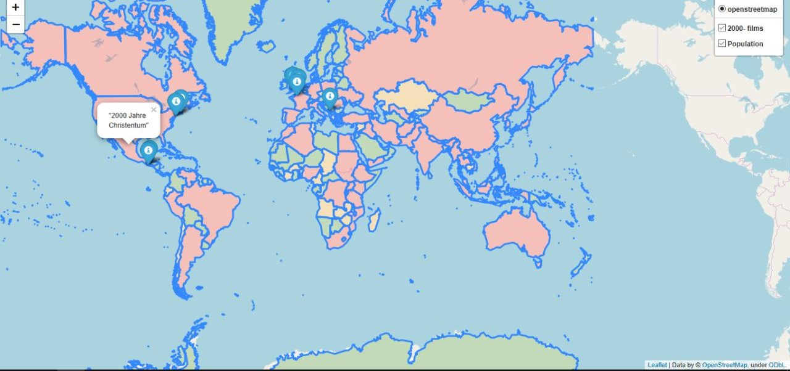

# Map_second_lab

Map_second_lab is a Python module for creating a multi-layer map:\
1 - the closest movie spots (max 10)\
2 - the world's population map

## Usage

```python
import folium

map_1 = folium.Map() # creates a map
fg = folium.FeatureGroup() # creates a layer
fg.add_child(folium.Marker()) # edits a layer
map_1.add_child(folium.LayerControl()) # separetes layers
map_1.save('Map_1.html') # creates the html file

from geopy.geocoders import Nominatim

geolocator = Nominatim(user_agent="specify_your_app_name_here", timeout=3)  # finds location:
geolocator.geocode("Lviv").latitude, geolocator.geocode("Lviv").longitude]) # latitude and longitude

import haversine

haversine.haversine((loc_1_lt, loc_1_ln), (loc_2_lt, loc_2_ln))) # calculates the distance between the points in their coordinates
```

## Conclusion

On created the map we can see, including various layers, the distribution of the world's population
and the top nearest to you ten places where films were created of the year you entered.
Also, by clicking on the icon, we will see what movie was made there

## Example

> Введіть рік: `2000`\
> Введіть широту: `48.287312`\
> Введіть довготу: `25.1738`\
> Введіть шлях до файлу з фільмами (якщо це інший файл, він має мати таку ж конструкцію як і даний файл): `C:\sec_semester\locations.list`\
> Введіть шлях до файлу з населенням (якщо це інший файл, він має мати таку ж конструкцію як і даний файл): `C:\sec_semester\lab2\world.json`\
> Map is generating...\
> Please wait...\
> Finished. Please have look at the map **Map_1.html**

